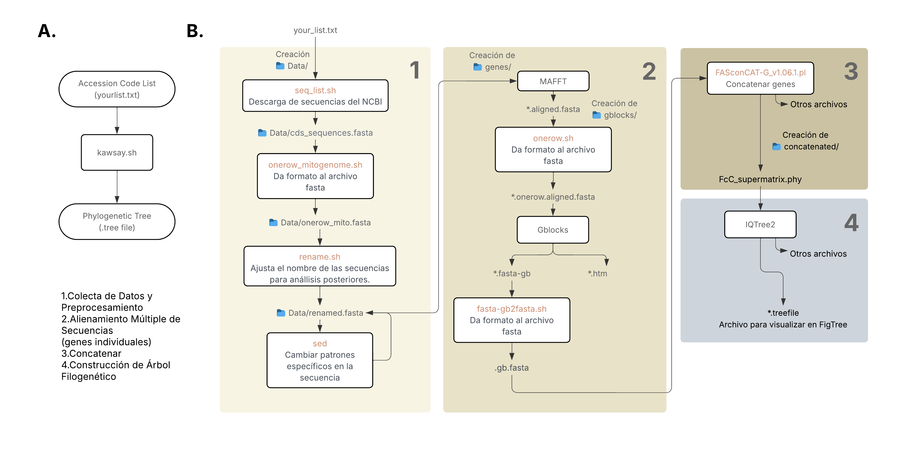

# Desarrollo de pipelines 

**Autor: Isabel Ruiz**

**Fecha: 15.07.2025**

**Versión: v.0.3**

Tutorial adaptado de Chen et. al. (2025). Comparative analysis of the mitochondrial genomes of the softshelled turtles *Palea steindachneri* and *Pelodiscus axenaria* and phylogenetic implications for Trionychia. [Acceder aqui](https://www.nature.com/articles/s41598-025-90985-2)

Objetivo: 
* Implementar un *pipeline* para realizar análisis filogenéticos basados en Maximum Likelihood.

## Introducción
Palea y Pelodiscus (orden Trionychia) son dos géneros de tortugas blandas que habitan en China y Vietnam. Las relaciones filogenéticas aún no se encunetran resueltas habiendo una discrepancia entre análisis basados en características morfológicas y secuencias de genes mitocondriales. Chen et al. (2025) secuenciaron los genomas mitocondriales completos de *P. steindachneri* y *P. axenaria*, que podría ayudar a resolver las relaciones filogenéticas dentro de este grupo. Por ello, se realizó una filogenia con los genes codantes mitocondriales concatenados de *Palea steindachneri* y *Pelodiscus axenaria* junto a otras especies de testudinos. 

Cada gen codante mitocondrial se analiza de manera independiente debido a que cada gen tendrá una tasa de tasa de mutación y presión selectiva diferente. Además, esta aproximación permite limpiar y verificar individualmente cada alineamiento antes de concatenarlo. Por ejemplo, puede realizar el alineamiento por alineamientos por codones (ej. TranslatorX) y/o eliminación de regiones ambiguas (ej. Gblocks). Esta metodología mejora la resolución del análisis filogenético y permite integrar modelos de partición, donde cada gen conserva su modelo evolutivo específico. 

# Importante
⚠️ Antes de iniciar recuerde definir su carpeta de trabajo. 

⚠️ Revisar que los archivos `.sh` tengan permiso de escritura. Puede darse con `chmod 777 yourscript.sh`.

⚠️ Siempre tener una copia de respaldo de sus datos. 

El archivo `kawsaytree.sh` está listo para ser usado después de ser descomprimido de la carpeta .zip. 
* Uso local: Debe asegurarse que los programas estén instalados, ya sea de manera local o mediante `conda`. En el Apéndice puede encontrar más información acerca de los requerimientos computacionales e instalación de programas.

* Uso en AWS: los programas ya se encuentran instalados en el ambiente `turtles`. Puede descargar una copia del archivo .zip y descomprimirlo para ejecutarlo dentro de su carpeta de trabajo. Asegúrese de brindar los permisos de ejecuión necesarios. Las carpetas anteriores vistas en clase no se encuentran actualizadas. Puede usarlo para constratar las líneas de comando adicionadas para resolver los `bugs`, vistos en clase.

```
conda activate turtles
```
# Ejecución del pipeline

Ejemplo:
```
./kawsaytree.sh -h
```
Mensaje que se debe mostrar tras ejecutar el comando. Si muestra algún error puede ser porque debe darle permiso de ejecución y escritura al *script*, para ello puede utilizar `chmod 777 kawsaytree.sh`. 
```
=============================================================================
# Script Name: kawsaytree.sh
# Description: This script runs a phylogenetic analysis on a given 
#              mitochondrial PCGs FASTA input file.
# Author: sciruiz
# Date: 2025-07-15
# Version: 1.1.0
# Usage:
#   ./kawsaytree.sh -i sequence_list.txt
#
# Required Arguments:
#   -i | --input       : Path to input accession codes list in .txt 
# Optional:
#   -h | --help        : Show this help message and exit
# =============================================================================
```
Nota: Presione *Enter* para salir de esta ventana. Automáticamente se guardará un archivo `.log`. Tenga cuidado de no sobrescribir el archivo si ejecuta el comando varias veces seguidas. Puede cambiar el nombre del archivo `.log` modificando el archivo de salida de la línea 5 del *script*.

**Comando para ejecutar.**
```
./kawsaytree.sh -i yourlist.txt
```

También puede ejecutarse línea a línes y ver cómo funciona. 

## Pipeline: KawsayTree

Pipeline `KawsayTree`. A. Perspectiva general. B. Desglose. 

## Ejecución línea a línea del script. 

> Las siguientes instrucciones explican paso a paso de la lógica detrás de la construcción del pipeline `kawsaytree.sh`. Algunos pasos fueron reutilizados del prototipo original, mientras que otros fueron ajustados o añadidos posteriormente. También se incluyen preguntas a modo de  validación para asegurar que se esté manejando los datos esperados y reducir posibles errores durate su ejecución.

### 1. Descarga y procesamiento de las secuencias 
La lista de secuencias está disponible en el artículo de Chen et. al. (2025). Utilizaremos solo los genes codantes de proteínas (PCGs) mitocondriales. 

>🔎 Revisar el artículo para encontrar la lista de secuencias. ¿Cuántos secuencias son? ¿Cuántes genes mitocondriales espera encontrar por especie?

1.1. Descargar PCS del GenBank, puede ingresar la lista directamente e Genbank (base de datos: `nucleotide`), `sent to`, `FASTA`, y seleccionar la opcion `Protein Coding Sequences`. 

¿Qué comando podría utilizar para descargar las secuencias desde la terminal? ¿Qué comando utilizaría para saber cuántas secuencias son? ¿Qué formato tiene el archivo?

KawsayTree v.1.0 usa el script `seq_list.sh` que necesitará una lista (.txt) con los códigos de accesión de la siguiente manera.
```
NC_054232.1
KX882744.1
NC_014054.1
KX882745.1
.
.
.
NC_021371.1
```

Nota: Cuando parece no poder ejecutarse un archivo desde la terminal, puede convertir el archivo a Unix. Usualmente los archivos generados en windows tienen caracteres innecesarios no visibles para el usuario. Puede usar `dos2unix` o `sed -i 's/\r//' your_file.txt`

1.2. *Pasar a un sola línea*

Usar el script `onerow_mitogenome.sh`

1.3. *Renombrar el archivo fasta*

Usar el script `rename.sh`

Verificar que el número de genes por especie, corresponda al archivo original. ¿Qué comando usaría?. A continuación un ejemplo.

```{bash}
while read -r gene || [[ -n "$gene" ]]; do count=$(grep -ow "$gene" renamed.fasta | wc -l); printf "%s\t%s\n" "$gene" "$count"; done < input/mito_genes.txt
```

* Realizar una revision manual del nombre de las secuencias por si hay ajustes puntuales que pueden no estar contemplados por su script. . 

1.4. *Separar cada PCG a un solo archivo*
Usar el script `separate_files.sh`. Luego, para eliminar toda informacion que este despues del ".GEN" usar. 
```{bash}
sed -i 's/\..*//' *.fasta
```
*¿Cómo verificar que tenemos el número de archivos esperado?*
```{bash}
find . -type f | wc -l
```
1.5. Uniformizar la longitud del nombre a un numero de caracteres dado 
>*¿por qué debe realizarse esto?* Los *scripts* que transforman archivos `.fasta` con saltos de lineas (Secuencia A) a una sola lina (Secuencia B) en este pipeline se guían a partir del nombre de la secuencia para separarlo. 

```{bash}
# Por ejemplo, este es el comando para onerow.sh detallado. 

for file in genes/*.fasta; do sed -E '/^>/ {s/^(>)([^[:space:]]{8})$/\1\2_/;}' "$file" > temp && mv temp "$file"; done
```

Los siguientes pasos debe realizarse a cada uno de los archivos. 

### 2. Alineamiento Múltiple de Secuencias

Alineareamos con MAFFT.
```{bash}
#Create a folder to include the aligned files
mkdir aligned
#Run MAFFT
for i in genes/*.fasta; do mafft --quiet "$i" > "aligned/$(basename "${i%.fasta}").aligned.fasta"; done
```
Usar el script `onerow.sh` para dar formato a una sola linea

### Eliminación de caracteres ambiguos
Usaremos el programa [GBLOCKs](https://home.cc.umanitoba.ca/~psgendb/doc/Castresana/Gblocks_documentation.html).
```{bash}
for i in gblocks/*.fasta; do programas/Gblocks_0.91b/Gblocks $i -t=d -b5=n -p=y; done
```

Vamos a reorganizar la carpeta, ingresar a la carpeta oneline.
```{bash}
cd gblocks
mkdir fasta-gb html
mv *.fasta-gb fasta-gb/
mv *.htm html/
```

Transformarmos de `.fasta-gb` a `.fasta`. Usaremos el script `fasta-gb2fasta.sh`.

### 3. Concatenar
Usaremos [FASconCAT-G](https://github.com/PatrickKueck/FASconCAT-G). Debe ubicarse en la carpeta que contiene a los genes alineados y trimeados con GBLOCKs. 
```{bash}
cd gblocks/onerow/
perl ../../programas/FASconCAT-G/FASconCAT-G_v1.06.1.pl -p -p -s
```
Mover los archivos generados a la carpeta `concatenated/`
### 4. Análisis filogenético
Vamos a correr el archivo en IQTREE2 o IQTREE3. El ejemplo mostrado abajo es en IQTREE3, no obstante en el *script* `kawsaytree.sh` se usa IQTREE2. 
```{bash}
#help for iqtree3
programas/iqtree-3.0.1-Linux/bin/iqtree3 -h
#comand for iqtree3
programas/iqtree-3.0.1-Linux/bin/iqtree3 -s concatenated/FcC_supermatrix.phy -m MFP -B 1000
```

## Visualizar el árbol filogenético
Podemos usar el ejecutable FigTree. El archivo a abrir termina en `.treefile`.
Recomendación: Puede renonmbrar los nombres en el archivo usando `sed`. 
```{bash}
sed -i 's/code1/long_name1/g' yourfilename.T1;
```
>🔎 Desarrollar un *script* que permita renonmbrar a partir de una lista de accesión o el seudónimo usado (Pista: revisar la línea 112 y 113 de `kawsaytree.sh`) a su nombre científico.  

# Apéndice
### Requerimientos 

Puede trabajarse con WSL o Ubuntu. El código se puede adaptar a Mac. 

Software Recomendado si usa interfaz de Windows. 
* VS Code Studio (Extensiones a instalar: Markdown, WSL (solo si está en windows), Display PDF in VSCode (Tomoki))

Software en terminal 
* Conda, miniconda and miniforge (debe estar instalado)
* Dos2Unix (this requires your Ubuntu/Linux password)
```
sudo apt install dos2unix
```
* MAFFT
```
conda install bioconda::mafft
```

**Ejecutables**

Puede definir una carpeta para guardar los programas. Similar a `kawsaytree.sh`

```
mkdir programas
```
* Gblocks
Eliminación de caracteres ambiguos 
```
#it creates a default folder
wget https://ponce.cc/slackware/sources/repo/Gblocks_Linux64_0.91b.tar.Z
uncompress Gblocks_Linux64_0.91b.tar.Z
tar xvf Gblocks_Linux64_0.91b.tar
rm Gblocks_Linux64_0.91b.tar 
```
* FASTconGENE

Programa para concatenar secuencias en .fasta. 
```
git clone https://github.com/PatrickKueck/FASconCAT-G.git
```

* FigTree

Programa para visualizar árboles filogenéticos. 
```
cd programas/
wget https://github.com/rambaut/figtree/releases/download/v1.4.4/FigTree.v1.4.4.zip
unzip FigTree.v1.4.4.zip 
rm FigTree.v1.4.4.zip  
```
* IQTREE2 o IQTREE3

Reconstrucciones filogenéticas con *Maximum Likelihood*
```
conda install bioconda::iqtree
```
Opcional: si quiere usar de manera local IQTREE3. Puede actualizar el *script* `kawsaytree.sh` para utilizarlo. 
```{bash}
wget https://github.com/iqtree/iqtree3/releases/download/v3.0.1/iqtree-3.0.1-Linux.tar.gz
tar xvf iqtree-3.0.1-Linux.tar.gz
rm iqtree-3.0.1-Linux.tar.gz 
```

© 2025 Isabel Ruiz. Todos los derechos reservados.
